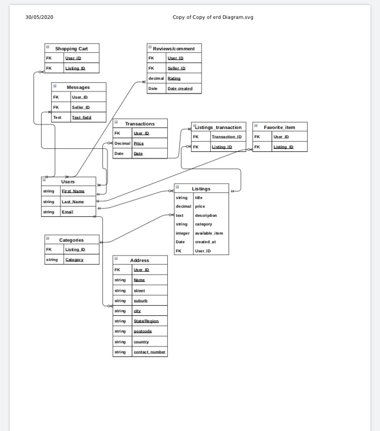

# Question 1

### Describe the architecture of a typical Rails application

Ruby on rails is an example of Model-View-Controller(MVC) architectural pattern, Rails is a web development framework for database back-ended applications this framework is becoming very popular in the agile development due to its productivity and agility features, ruby on Rails have built-in solutions to many common problems that developer face during web development, its the programing language that follows the rule of convention over configuration, rails takes the idea of separating an application's data, user interface, and control logic to a whole new level. The idea of MVC is to split application into 3 component such as Model:is handling data and business logic of the application and make rules to manipulate the data, and use to manage interaction with database, represent information in database and do a validation. Views:is handling graphical user interface objects and presentation, views are HTML files with embedded Ruby code Views are used to provide the data to the browsers that requested the web pages. Controllers: is for handling the user interface and application, interact with models and views hich process the data from the models and pass it to the views for presentation. Rails web applications are often hosted on a web-server such as Puma, and operate by routing HTTP requests send from a users machine over the internet to specified controllers and functions of your application which will return the appropriate data to the users browser.

## Ref

- https://www.techcareerbooster.com/blog/ruby-on-rails-architecture-overview-for-beginners/

- https://www.sitepoint.com/model-view-controller-mvc-architecture-rails/

- https://adrianmejia.com/ruby-on-rails-architectural-design/

# Question 2

### Identify a database management system (DBMS) commonly used in web applications (including Rails) and discuss the pros and cons of this database

SQLite is an open-source Relational Database Management System which boasts the features of being self-contained, serverless and zero configuration. SQLite also comes packaged by default with Rails.

- Pros: SQLite is open source, serverless which means it is simple to set up and zero configuration is required, lightweight very easy to use its come with a packet when you install rails, Great for development and testing, accescible you can access SQLite througt a variety of third party tools, reduce cost and complexity. Because SQLite does not support client-server negotiation, so accessing the database is much faster, and data is much easier to secure as you can protect your database as you would any other file, with no need to worry about malicious incoming requests.

- Cons: SQLite misses out on some SQL queries and syntax, doesn’t provide network access ex: you can't access to your data if you on difference machine, can also make it difficult to transition from another DBMS into SQLite, its doesn't built for large-scale Database size is restricted to 2GB in most cases applications, and can only handle low to medium traffic HTTP requests

### Ref

- https://www.keycdn.com/support/sqlite-vs-mysql

- https://www.javatpoint.com/sqlite-advantages-and-disadvantages

# Question 3

### Discuss the implementation of Agile project management methodology

Agile Software Development is a software development approaches, it builds on the idea of iterative development where the software is built and delivered to the client in increments, allows developer to break large projects down into more manageable tasks, enables a team to adapt to change quickly and deliver work is a process by which a team can manage a project by breaking it up into several stages and involving constant collaboration with stakeholders and continuous improvement and iteration at every stage. The Agile methodology begins with clients describing how the end product will be used and what problem it will solve. In order to implement Agile project management, you need t set out a principles as folling.

- Encourage heavy communication between stakeholders and developers, Agile emphasizes collaboration and teamwork, both within the project team, customer, and other key stakeholders such as your project sponsor and vendors, in order to successfully adopt Agile it’s very important that everyone is on board before project start. you must Talk to the key players, explain the benefits of Agile, answer any questions they have, and make sure their concerns has given and answer.

- Focus on deliver in frequent iteractions with customer this allows them to see the progress of project so they can inform you if need any changes or additions. Always remain receptive to changes from your client, as this will only benefit the application and customer satisfaction. because customers are one of your most powerful assets, Whether customer are internal or external, having customer involve throughout the process can help to ensure that the end product meets their needs more effciency.

- Ensuring the process of developing your aplication is not hindering the performance of team members, team member is crucial to the creation of a quality product. Working as a team is very important in order to achieve customer satification and you can be sure to deliver working software in the agreed timeframe Agile projects rely on team members to communicate, collaborate, and problem solve. If your project team isn’t engaged and motivated, an Agile approach won’t be successful. After all, one of the key principles of Agile is to build projects around motivated individuals, give them what they need, and then trust them to get the job done.

### Ref

- https://www.agilealliance.org/agile101/12-principles-behind-the-agile-manifesto/
- https://www.wrike.com/project-management-guide/faq/how-to-implement-agile/

# Question 4

### Provide an overview and description of a standard source control workflow.

Source/version control has become a very imprtant part in the software development cycle and collaboration of multiple developers, version control allow multiple developer to simultaneously work on a single project, each person edits his or her own copy of the files and chooses when to share those changes with the rest of the team. Thus, temporary or partial edits by one person do not interfere with another person's work. The workflow of a source control starts with the creation of a repository, this is where all the files associated with the application are held Version control integrates work done simultaneously by different team members, In most cases, edits to different files or even the same file can be combined without losing any work, In rare cases, when two people make conflicting edits to the same line of a file, then the version control system requests human assistance in deciding what to do, the master branch is then defined which is where final changes from developers are pushed when the code is confirmed to be appropriate and reliable.

### Ref

- https://homes.cs.washington.edu/~mernst/advice/version-control.html

- https://www.atlassian.com/git/tutorials/what-is-version-control

# Question 5

### Provide an overview and description of a standard software testing process (e.g. manual testing)

Software testing is a process of verifying and validating the functionality of an application to find whether it satisfies the specified requirements. It is the process of finding defects in an application and check where the application functions according to the end user's requirements. Manual testing is a type of Software Testing where Testers manually execute test cases without using any automation tools, its the most primitive of all testing types and helps find bugs in the software system and potential mistakes. Also it is one of the most fundamental testing processes as it can find both visible and hidden defects of the software. The difference between expected output and output, given by the software, is defined as a defect. The developer fixed the defects and handed it to the tester for retesting.

There are various methods used for manual testing. Each technique is used according to its testing criteria. Type of manual testing are include: White Box Testing, Black Box Testing
Gray Box Testing.

- White-box testing: The developer is proceed the white box testing before developer passing a code to engineer he have to check every line of code.

- Black box testing: The test engingeer proceed the black box testing to ensure that application functionality or software is meet the requirement of client.

- Gray Box testing: Is the test from both white and black box proceed, this can perform by a person who know both coding and tesing.

### Ref

- https://www.guru99.com/manual-testing.html

- https://www.softwaretestinghelp.com/manual-testing-tutorial-1/

- https://www.javatpoint.com/manual-testing

# question 6

### Discuss and analyse requirements related to information system security and how they relate to the project

Web developer/software engineer cyber security and protecting application's data is our priority, If application contain sensitive user data such as names, addresses, phone numbers/emails, medical records or payment information, it is the responsibility of all IT professionals to ensure that appropriate measures have been put in place to prevent from malicious attacks. As computers and other digital devices have become essential to business and commerce, they have also increasingly become a target for attacks. In order for a company or an individual to use a computing device with confidence, they must first be assured that the device is not compromised in any way and that all communications. web developer protect information by restrict access only to those who are allowed to see the application data information, everyone else should be disallowed. Below are examples of potential threats to the security of web application:

- Cross-Site Request Forgery: Also known as CSRF a web security vulnerability that allows an attacker to induce users to perform actions that they do not intend to perform, It allows an attacker to partly circumvent the same origin policy, which is designed to prevent different websites from interfering with each other, Attacker trick the user by performing payment transations, password changes and other malicious actions without the knowledge of the user. In this case i will ensure the correct authentication checks are carried out in my web application to prevent this to happen.

- Integrity: Is a only a person with integrity can be trusted to allow to see or make change application's data. Because information can lose its integrity through malicious attack, For example the universities restrict access to private student information, The university must be sure that only those who are authorized have access to view the grade records, If someone who is not authorized makes a change to intentionally misrepresent something an example of this would be when a hacker is hired to go into the university’s system and change a grade. In this case i will ensure the correct user name and password are being use with intergrity in my web application to prevent this to happen.

- Phishing Attacks: Is a method from attacker trying to gather personal information using deceptive e-mails, direct messages or phone calls and attempt to trick users into providing sensitive information, the goal is to trick recipient into believing that the message is something they want or need then attacker will request their personal detail, bank details..etc. When it comes to my web application, this could be a bit difficult to protect against as it often comes down to common sense, but ensuring your users that they should never respond to unsolicited requests for their personal information is very important.

### Ref

- https://www.csoonline.com/article/2117843/what-is-phishing-how-this-cyber-attack-works-and-how-to-prevent-it.html

- https://bus206.pressbooks.com/chapter/chapter-6-information-systems-security/

- https://portswigger.net/web-security/csrf

# Question 7

### Discuss common methods of protecting information and data and how you would apply them to the project

The protection of an applications information/data is extremely important as there are often legal obligations attached to protect the users and their online presence. Below are data protection include:

- Authentication: Authentication, encryption a passwords are high on the list of critical importance, Authentication come along with authorization is one of the recommended way to protect data from being breaches by storing secure data in an encrypted format when kept on a server and using secure tokens for authentication, and implimenting a login system whether that be through Cookie/Session authentication, Web Tokens or OAUTH can go a long way in the protection of your data, By requiring a user to log in in order to perform certain actions. As web developer i will creating a barrier against intrusion from unrelated/unauthorised third-parties, So on my application i will use a gem call devise it is a secure way of ensuring appropriate authentication are being use on my application.

- Encryption: Data encryption software effectively enhances data security by using an algorithm (called a cipher) and an encryption key to turn normal text into encrypted ciphertext That data can then be decrypted only by a user with an authorized key, without authorlized key the cipher data will be unreadable. Encryption is used to protect the data that you store (called data at rest) and data exchanged between databases, mobile devices, and the cloud (called data in transit), By encryped sensitive data using an encryption method you can protect your data from the potential risk unable to read the plain-text in your databases. eventhought someone has gain access to your database tables, they wouldn't met with encrypted strings of text, which they would have no way of decrypting. In my application data must be encrypted, encryption keys must be securely managed, off-site encryption backup, and restricting access. I will use The Stripe and Devise gem because its come with the appropriate forms of encryption and security so i can ensure that its safe from cyberattacks.

- Access control: Allows access to resources based on the identity of users or groups, Setting certain permissions for specific roles it is very efficient risk reduction method to limit and monitor the actions that users can take on your applications, The fewer people have access to the data, the lesser the risk of (inadvertent) data breach or loss. You should ensure that you give access to sensitive data only to an authorized person who have a valid password to access. At important sections of your application, you should only give permissions for moderators or administrators who signed in as specific administrator account for the management role. on my application i will make sure that users are only give access to read listings and alter their own listings.

### Ref

- https://gdprinformer.com/gdpr-articles/6-essential-data-protection-methods

- https://netxinc.com/9-logical-ways-to-begin-securing-your-data/

- https://looker.com/definitions/data-security

# Question 8

### Research what your legal obligations are in relation to handling user data and how they can be met for the project

Businesses may need to abide by guidelines outlined in the Privacy Act 1988 given they fit a certain number of requirements such as a The Privacy Act contains exemptions for certain organisations. For example, operators of small businesses (broadly, businesses with an annual turnover for the previous financial year of \$3,000,000 or less) are not generally subject to the Privacy Act, except in specific circumstances, e.g. where the small business provides a health service and holds health information, discloses personal data for a benefit, service or advantage, or is a contracted service provider for a Commonwealth contract. Some of these guidelines include:

- Open and transparent management of personal information: Ensuring a sense of transparency with your users in the ways you handle and use their personal information, to ensure compliance with the remaining APPs and that enable them to deal with inquiries and complaints.
- Anonymity and pseudonymity: Enabling users to operate within your domain anonymously or under a pseudonym.

- Use or disclosure of personal information: Use or disclosure of personal implementing appropriate measures to secure sensitive information from malicious attacks, prohibited information of an APP entity from using or reveal personal for only what the purpose are, unless the individual consents, the individual would reasonably expect their personal information to be used for the secondary purpose, or another prescribed exception applies.th

As my project is smalll, in a way of legal sense, I wound't have to concern much about protecting user data, I would mainly focus more on user accout, password, authorization, payment transaction. As i am using devise and stripe gem its has a build in security that can protecting data information. I believe i have done my responsibility to Privacy Act. i will allow users to have a custom Username, aside from their name for the shipping address, which would follow the guidlines outlined in the Privacy Act as well.

# Question 9

### Describe the structural aspects of the relational database model. Your description should include information about the structure in which data is stored and how relations are represented in that structure.

Relational database model is the primary data model, which is used widely around the world for data storage and processing. This model is simple and it has all the properties and capabilities required to process data with storage efficiency, It has many advantages to its composition such as its query flexibility, making complex search queries easy for developers and users. For example: represents the database as a collection of relations. A relation is nothing but a table of values, Every row in the table represents a collection of related data values, These rows in the table denote a real-world entity or relationship.

Some popular Relational Database management systems are:

- DB2 and Informix Dynamic Server - IBM
- Oracle and RDB – Oracle
- SQL Server and Access - Microsoft

Below are relational databases concepts:

- Attribute: are columns that belong to the entity modeled by the table (ex. In a student table, you could have name, address, student ID, major, etc.).
- Tables: every data input is stored in a row of a specific table, and every attribute is defined by the columns of the table.
- Tuple: represents a single entity (ex. In a student table, John Smith, 14 Oak St, 9002342, Accounting, would represent one student entity).
- Relation schema: A relation schema represents the name of the relation with its attributes.
- Degree: the total number of attributes which in the relation is called the degree of the relation.
- Cardinality: total number of rows present in the Table.
- Relation instance: a finite set of tuples in the relational database system represents relation instance. Relation instances do not have duplicate tuples.
- Relation key - Every row has one, two or multiple attributes, which is called relation key.
- Attribute domain – Every attribute has some pre-defined value and scope which is known as attribute domain

### Ref

- https://www.guru99.com/relational-data-model-dbms.html
- https://databasemanagement.fandom.com/wiki/Relational_Database_Model
- https://www.tutorialspoint.com/dbms/relational_data_model.htm

# Question 10

### Describe the integrity aspects of the relational database model. Your description should include information about the types of data integrity and how they can be enforced in a relational database.

As a web developer maintaining the quality and reliability of database stored is very importance to businesses as the integrity of your databases can directly impact costs and overall to business. Data integrity is known as the accuracy, consistency, and reliability of data that is stored in the database. Both database designers and database developers are responsible for implementing data integrity within one or a set of related databases.

There are four types of data integrity:

1. Entity Integrity: is defines each row in database to be unique within its table. No two rows can be the same.
2. Referential integrity: a foreign keys in a database is a second table that can refer to a primary key table within the database.
3. Domain integrity: is the validity of entries for a given column and the common ways to input and read this data. For example: if a database uses monetary values to include dollars and cents, three decimal places will not be allowed.
4. User-defined integrity: User-defined integrity allows the user to apply business rules to the database that aren’t covered by any of the other three data integrity types.

Here are factors that can affect the integrity of the data stored in a database:

- Human error: Whether malicious or unintentional, when user enter information incorrectly, duplicate or delete data, don’t follow the appropriate protocol, or make mistakes during the implementation of procedures.
- Transfer errors: Transfer errors happen when a piece of data is present in the destination table, but not in the source table in a relational database.
- Bugs, viruses/malware, hacking, and other cyber threats
- Compromised hardware, such as a device or disk crash
- Physical compromise to devices hardware may render data incorrectly or incompletely, limit or eliminate access to data, or make information hard to use.

Here are some idea to implement methods of reducing the risk of data integrity issues:

- Validating data input: Whether that be through form types, requirement checking etc, it is good practice to validate data before its even entered into a database.
- Data encryption, which locks data by cipher.
- Data backup, which stores a copy of data in an alternate location.
- Scheduled cleaning of database entries: By routinely inspecting for duplicate data, orphaned tables and other data errors, its easy to keep on top of the condition of your databases aswell as reducing storage costs and general bloating.
- Access controls, including assignment of read/write privileges, By controlling who has access to certain sections of data, you can reduce the risk of both human error whilst working in a database and any potential attacks from third parties.

### Ref

- https://www.veracode.com/blog/2012/05/what-is-data-integrity

- https://digitalguardian.com/blog/what-data-integrity-data-protection-101

- https://www.talend.com/resources/what-is-data-integrity/

- https://www.promptcloud.com/blog/7-steps-to-improve-data-integrity/

# Question 11

### Describe the manipulative aspects of the relational database model. Your description should include information about the ways in which data is manipulated (added, removed, changed, and retrieved) in a relational database.

Manipulative relational database is adding new data, changing the values of existing data and reorganizing the data. Another basic form of data manipulation is to retrieve specific information from the database.

For example, for a database of employees within an organization, you may want to find just the employees hired within the last year or those holding a certain position. In database terminology, this is called a query. The term 'query' means 'to search, to question or to find.' So, a database query is like asking a question of the database.

- Add or INSERT: statement allows you to add new records to your database table, you can specifies the table or view that data will be inserted into, once you have insert Column_list lists columns will be affected, If a column is omitted, each value must be provided, If you are including columns, they can be listed in any order. VALUES specifies the data that you want to insert into the table VALUES is required.

- Removed or DELETE: has the ability to delete one or more records in full. if you want to deleting individual column content you can't do that. If you want to do that, you need to first UPDATE statement to change the content of the individual columns. So DELETE is the deletion of a full record or multiple full records. once you delete a series of records, they're gone and there's no way of getting them back. before deleting you need make sure that the record that you want to delete from the table, that entry (or its value) is not being used by any other table because that will cause problem.

* Changed or UPDATE statement is use for changes data in existing rows either by adding new data or modifying existing data. Update statements allow you to change the data in specific columns for rows stored in a table. For example: you can choose a specific row to update by including the WHERE clause and utilize a unique set of values.

* Retrieved or SELECT The SELECT statement, or command, allows the user to extract data from tables, based on specific criteria. It is processed according to the following sequence:
  SELECT DISTINCT item(s) FROM table(s)WHERE predicateGROUP BY field(s)ORDER BY fields.

### Ref

- https://www.simplilearn.com/data-manipulation-in-sql-tutorial
- https://study.com/academy/lesson/structured-query-language-manipulating-databases-using-sql.html
- https://en.wikipedia.org/wiki/Data_manipulation_language#:~:text=A%20data%20manipulation%20language%20(DML,updating)%20data%20in%20a%20database.&text=A%20popular%20data%20manipulation%20language,data%20in%20a%20relational%20database.
- https://www.pluralsight.com/guides/sql-data-manipulation-language
- https://opentextbc.ca/dbdesign01/chapter/chapter-sql-dml/

# Question 12

### Identify and explain the workings of TWO sorting algorithms and discuss and compare their performance/efficiency (i.e. Big O)

A Sorting Algorithm is used to rearrange a given array or list elements according to a comparison operator on the elements. The comparison operator is used to decide the new order of element in the respective data structure.

- Bubble Sort: is the simplest sorting algorithms with a very simple method of sorting. The basic idea is that bubble sort performs multiple passes on a data set, swapping adjacent values if they aren't in the correct order. Once all values are in order, the algorithm will stop its passes and return the sorted set. Bubble sort work by compares adjacent elements of an array and organizes those elements. It loops through an array and sees if the number at one position is greater than the number in the following position which would result in the number moving up. This cycle repeats until the algorithm has gone through the array without having to change the order. This method is advantageous because it is simple and works very well for mostly sorted lists. As a result, programmers can quickly and easily implement this sorting algorithm. However, the tradeoff is that this is one of the slower sorting algorithms. Bubble sort is to implement Worst Case = O(n^2).

- Quick sort: is one of the most efficient sorting algorithms, that's why it is one of the most used as well. quick sort work by after selecting an element as pivot, which is the last index of the array, then divide the array for the first time. In quick sort,this is call partitioning. The first thing to do is to select a pivot number, this number will separate the data, on its left are the numbers smaller than it and the greater numbers on the right. With this, you got the whole sequence partitioned. After the data is partitioned, you can assure that the partitions are oriented, known now that bigger values on the right and smaller values on the left. The quicksort uses this divide and conquer algorithm with recursion. So, now that we have the data divided we use recursion to call the same method and pass the left half of the data, and after the right half to keep separating and ordinating the data. At the end of the execution, you will have the data all sorted. This algorithm has a time complexity of O(n log n) or logarithmic/linearithmic time. This means that execution time for the sort grows in proportion to the logarithm of the set size. The first 'n' in 'n log n' is often ignored due to it being a fairly trivial effect to the running time when the set size is very large, we are mainly focussed on the 'log n'. Each time through the loop, the data set to search or sort is halved, so in a worst case, the algorithm will require log n steps.

Comparison

- Number of steps to sort with Bubble: O(10^2) = 100 Number of steps to sort with Quick: O(10 \* log2(10)) = 40

- Number of steps to sort with quick: O(10000^2) = 100,000,000 Number of steps to sort with Quick: O(10000 \* log2(10000)) = 140,000

### Ref

- https://www.geeksforgeeks.org/bubble-sort/
- https://lamfo-unb.github.io/2019/04/21/Sorting-algorithms/
- https://www.studytonight.com/data-structures/

# Question 13

### Identify and explain the workings of TWO search algorithms and discuss and compare their performance/efficiency (i.e. Big O)

- Linear Search: is the most basic type of searching algorithm. A Linear Search sequentially moves through your collection (or data structure) looking for a matching value, In every iteration, compare the target value with the current value of the array. If the values match, return the current index of the array.If the values do not match, move on to the next array element, If no match is found, return -1. This is a pretty good time complexity, however it's not the most efficient method to find a value in a set. Imagine the set is a thousands of items, and the value you're looking to match with is the last in the set, it will require the maximum execution time to find it. Realistically, it wouldn't take that long to find, but there are a better way to do it.

- Binary search: is the most popular Search algorithm. It is efficient and also one of the most commonly used techniques that is used to solve problems. Binary search looks for a particular item by comparing the middle most item of the collection, If a match occurs then the index of item is returned. If the middle item is greater than the item, then the item is searched in the sub-array to the left of the middle item.If the value of the search key is less than the item in the middle of the interval, narrow the interval to the lower half. Otherwise narrow it to the upper half. Repeatedly check until the value is found or the interval is empty. This sorting algorithm manages a time complexity of O(Log n), as every time the this search algorithm works on the principle of divide and conquer, This proves much more effective in larger data-sets.

Comparison

- binary search runs in O(logn) time whereas linear search runs in O(n) times thus binary search has better performance

- If we have 1000 elements to search, binary search takes about 10 steps, linear search 1000 steps.

### Ref

- https://www.studytonight.com/data-structures/linear-search-algorithm
- https://www.hackerearth.com/practice/algorithms/searching/linear-search/tutorial/
- https://www.freecodecamp.org/news/linear-search/
- https://www.geeksforgeeks.org/binary-search/
- https://www.khanacademy.org/computing/computer-science/algorithms/binary-search/a/binary-search
- https://www.tutorialspoint.com/data_structures_algorithms/binary_search_algorithm.htm

# Question 14

## Conduct research into a marketplace website (app) and answer the following parts

### a. List and describe the software used by the app.

I have chosen to conduct research into https://www.shopify.com/, Shopify is a complete Ecommerce platform that lets you start, grow, and manage a business. Create and customize an online store. Sell in multiple places, including web, mobile, social media, online marketplaces, brick-and-mortar locations, and pop-up shops. Manage products, inventory, payments, and shipping.

The tech stack utilised by https://www.shopify.com/ includes:

- Rails: a server-side web application framework written in Ruby.
- MySQL is the DB of choice
- React - The front-end framework
- Go/Lua to do job processing
- Docker containers to power individual Shops
- CoreOS as their production operating systems
- EJSON
- Liquid for templates
- Two ways to interact with APIs
- JSON accessible via ruby gem ( there a ready lib for PHP I think, and couple of other languages) - but it's plain REST JSON API - so it's easy to access using any library
  They released another API last year - Shopify POS App SDK - that's essentially using Javascript only to access various features on admin page.

### b. Describe the hardware used to host the app.

- Shopify makes it easy to buy and manage your custom domain, Configuration and setup are completely automated, You can Set your primary domain, Choose a memorable domain name to use as the face of your business online. You can also manage sub-domains Manage email forwarding, renew your domain names, and even remove domains from your store. Shopify makes it easy to create and register a domain name for your new website. You can buy a new domain through Shopify, use an existing domain, or use your free .myshopify.com domain.

- Shopify POS hardware: Shopify provided free hardware shipping and returns you can try Shopify’s point-of-sale hardware risk free with free shipping and 30-day returns. Compatible hardware accessories Build out your POS with compatible hardware available through the Shopify Hardware store. Pair accessories like barcode scanners, receipt printers, cash drawers, and more. Customize your checkout counter with the hardware you need for your store. Integrate Shopify’s card readers with your existing setup or visit the Shopify Hardware store to build your full kit.

- Shopify POS software: You can get Shopify's POS software in a powerful mobile app, Download the app on your iPhone or iPad to turn your smartphone or tablet into a portable POS.
  Connectivity screens.

### c. Describe the interaction of technologies within the app.

The data for the web-application is held by Shopify, every time a client wants to visit the Shopify website, they will be visiting the domain IP address of the shopify. Shopify domain will recieve all HTTP requests from client machines and pass them through to the Rails framework This is where rails will perform its action and transfer where to route the incoming request. If an object is required, Rails will talk to MYSQL and find the appropriate tuple(s). This data is then returned to Rails where it can perform whatever functions it needs to, and then send response data back to the client machine via HTTP and the World Wide Web.

### d. Describe the way data is structured within the app

Data within shopify.com is structured using the Relational Database Model imposed by MySQL. Each object within the application requires a table. Every attribute for an object is defined by the colums of the table, and every tuple is stored as a row within the corresponding table. Relations between models are columns defined by the developer. (Eg. A Items table would have a relation/reference column for a User_ID, as a Item belongs to the User that posted it.)

### e. Identify entities which must be tracked by the app

In order for a Rails web application to run, the developer needs to define all the objects/models that required for the operation of each feature they have planned. Entities required for shopify.com may include:

Users, Seller reviews, Shopping cart, Transaction history, Conversation between both users, Addresses, Catagories, Favorite item, listing comment, rating item.

### f. Identify the relationships and associations between the entities you have identified in part (e)

User

- Has many Listings
- Has many Addresses
- Has many Shopping Carts
- Has many Seller Reviews
- Has many Conversations
- Has many Favorite items
- Has many Transactions
- Has many Comments
- Has many Rating items

Address

- Belongs to User

Listing

- Belongs to User
- Has one Catagory
- Has many Listings Transactions

Catagories

- Belongs to Listing
- has_many Listings

Seller Reviews

- Belongs to User
- Has one User

Favorite_item

- Belongs to User
- Has many Listings

Shopping_Carts

- Belongs to User
- Has many Listings

Transaction

- Belongs to User
- Has many listings via Listings_Transactions

Listings_Transactions

- Belongs to Transaction
- Has many listings.
- Conversations

### g. Design a schema using an Entity Relationship Diagram (ERD) appropriate for the database of this website (assuming a relational database model)

### Ref

- https://hardware.shopify.ie/
- https://www.shopify.com.au/domains
- https://dev.to/redcaptom1/shopify-app-from-scratch-4-tech-stack-d2p
- https://www.freelancinggig.com/blog/2018/08/16/what-programming-language-is-shopify-built-on/
